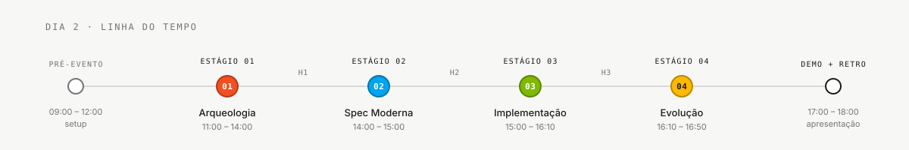

<!-- markdownlint-disable MD013 MD025 MD026 MD028 MD029 MD034 MD040 MD051 MD060 -->

# Primeiros 15 Minutos — Comece Aqui

  

> 🗺 **Você está aqui:** [Kit PT-BR](README.md) → **Comece aqui**

> **Para quem é isto?** Para você que acabou de chegar e quer saber: *"o que eu faço agora?"*. Não importa se você é Product Owner, Tech Writer, Dev, analista de negócio ou DBA — os 15 minutos abaixo servem para todo mundo.
>
> **O que você terá ao final destes 15 minutos:**
>
> 1. Saberá em que time/par está
> 2. Saberá qual é o ritmo do dia (4 estágios + demo)
> 3. Terá o glossário aberto em uma aba (para consultar jargão)
> 4. Terá o seu `PERSONA.md` lido (sabe o que você faz e quando)
> 5. Saberá o que fazer no Estágio 1 (que começa após o almoço)

---

## ⏱ Cronômetro

| Minuto | O que fazer | Tempo |
|---|---|---|
| 0–2 | Passo 1 — Confirme em que par você está | 2 min |
| 2–4 | Passo 2 — Abra o cronograma do dia | 2 min |
| 4–6 | Passo 3 — Abra o Glossário Visual | 2 min |
| 6–11 | Passo 4 — Leia o `PERSONA.md` do seu papel | 5 min |
| 11–15 | Passo 5 — Abra o Estágio 1 e a Cheat-sheet do Copilot | 4 min |

> [!NOTE]
> **Não subiu o ambiente ainda?** Tudo bem. Esses 15 minutos são só leitura. O setup técnico é feito depois — guiado pelo 00-SETUP.md.

---

## Passo 1 — Confirme em que par você está (2 min)

O time tem **5 pessoas e 10 personas** (cada pessoa cobre 2 personas, em um "par").

| Par | Personas | O que vocês fazem |
|---|---|---|
| **1 · Visão** | Product Owner + Requirements Engineer | Decidem **o que** vai ser modernizado |
| **2 · Arquitetura** | Enterprise Architect + Software Architect | Decidem **como** o sistema é organizado |
| **3 · Implementação** | Technical Lead + Developer | Escrevem o **código** |
| **4 · Qualidade** | DBA + QA Engineer | Cuidam dos **dados** e dos **testes** |
| **5 · Operações** | DevOps Engineer + Tech Writer | Cuidam do **deploy** e da **documentação** |

**Ação:** confirme com o facilitador em qual par você está. Anote aqui:

> Meu par: _______ • Minhas personas: _______ + _______

> **Não é programadora/programador?** Tudo bem. PO, RE, Tech Writer e parte do QA não precisam codar. Cada persona tem missão clara — você não vai ficar olhando ninguém compilar Java em silêncio.

---

## Passo 2 — Abra o cronograma do dia (2 min)

Abra [`00-TEAM-FLOW.md`](00-TEAM-FLOW.md) em uma aba. Olhe **apenas** o cronograma. O dia tem 4 estágios:



**O que prestar atenção:**

- Não dá pra pular estágios. O Estágio 2 depende do que sai do 1.
- **Entre os estágios há uma "passagem"** — momento em que o par de um estágio entrega ao par do próximo (5 min de conversa). Isso é importante.
- Se você travar por mais de **20 minutos**, levante a mão. É regra.

---

## Passo 3 — Abra o Glossário Visual (2 min)

Você vai cruzar com siglas e termos técnicos hoje (EARS, ADR, REQ-ID, DDM, Flyway, JPA…). **Não precisa decorar nenhuma.** Só abra esta página em uma aba e volte quando precisar:

👉 [`07-conceitos/03-glossario-visual.md`](07-conceitos/03-glossario-visual.md)

Cada termo tem 3 linhas: **o que é**, uma **analogia do dia-a-dia**, e **onde aparece**. Use sem culpa.

> **Exemplo:** "EARS" assusta. O glossário traduz: "forma padrão de escrever requisitos sem ambiguidade. Analogia: receita de bolo — tem ingrediente, ordem e tempo."

---

## Passo 4 — Leia o `PERSONA.md` do seu papel (5 min)

Você tem **duas personas**. Leia o `PERSONA.md` de cada uma:

```
05-personas/01-product-owner/PERSONA.md
05-personas/02-requirements-engineer/PERSONA.md
05-personas/03-enterprise-architect/PERSONA.md
05-personas/04-software-architect/PERSONA.md
05-personas/05-technical-lead/PERSONA.md
05-personas/06-developer/PERSONA.md
05-personas/07-dba/PERSONA.md
05-personas/08-qa-engineer/PERSONA.md
05-personas/09-devops-engineer/PERSONA.md
05-personas/10-tech-writer/PERSONA.md
```

**Foque em 3 seções de cada PERSONA.md:**

1. **"Onde você aparece em cada estágio"** — tabela de 4 linhas. Vai te dizer se você lidera, apoia ou observa em cada estágio.
2. **"Se travar (defaults de emergência)"** — o que fazer quando estiver perdida(o).
3. **"3 prompts de exemplo"** — copia-e-cola pronto para usar no Copilot.

> **Se sentir que sua persona "é igual" à outra**: olhe **quando** cada uma lidera. Quase nunca lideram juntas; é por isso que duas personas no mesmo par cobrem o dia inteiro sem ficar ociosas.

---

## Passo 5 — Abra o Estágio 1 e a cheat-sheet do Copilot (4 min)

### 5a. Abra o guia do Estágio 1

👉 [`01-arqueologia/GUIDE.md`](01-arqueologia/GUIDE.md)

Leia apenas:

- A seção **"O que você vai conseguir em 3 horas"** (5 artefatos)
- A tabela **"Quem lê o quê"** (quais 3 programas Natural seu par lê)
- A seção **"Hora 1 — Reconhecimento"** (o que vocês fazem entre 13:00 e 14:00)

Pronto. Você sabe o que vai fazer no Estágio 1.

### 5b. Abra a cheat-sheet dos 3 modos do Copilot

👉 [`09-cheat-sheets/copilot-3-modes.md`](09-cheat-sheets/copilot-3-modes.md)

Isso vai te poupar 30 minutos de confusão. **Três modos do Copilot:**

| Modo | Quando usar | Exemplo |
|---|---|---|
| **Ask** | Quero entender algo | *"Explique este programa Natural"* |
| **Plan** | Quero mudar código com calma | *"Adicione validação de CPF — me mostre antes de fazer"* |
| **Agent** | Quero delegar uma feature inteira | Issue do Estágio 4 |

### 5c. Se você nunca abriu o Copilot Chat

- VS Code → ícone do Copilot na barra lateral (parece um chapéu) → abra o chat
- Não vê o ícone? Pergunte ao facilitador. Pode ser que a extensão não esteja ativada.

---

## ✅ Checklist dos primeiros 15 minutos

Antes de avançar, marque:

- [ ] Sei em qual par estou e quais são minhas 2 personas
- [ ] Tenho o `00-TEAM-FLOW.md` aberto em uma aba (cronograma do dia)
- [ ] Tenho o `glossario-visual.md` aberto em outra aba (para consultar jargão)
- [ ] Li o `PERSONA.md` das minhas 2 personas (foquei nas 3 seções recomendadas)
- [ ] Sei o que vai acontecer no Estágio 1
- [ ] Sei o que são os 3 modos do Copilot (Ask, Plan, Agent)

Se tudo está marcado, **você está pronto**. Vá para o setup técnico (`00-SETUP.md`) ou direto para o Estágio 1, conforme o cronograma do dia.

---

## ⏱ Bônus — Primeira Hora **minuto a minuto** (para não-devs)

Se você nunca abriu VS Code, Docker ou Copilot, este roteiro literal te coloca pronto em 60 minutos. Faça **em ordem**, sem pular.

> [!TIP]
> 🤝 **Faça com alguém do seu par ao lado.** Duas cabeças passam por bugs de setup em metade do tempo.

| Min | Ação | Como saber que deu certo |
|---:|---|---|
| **00** | Abrir o terminal e rodar `cd ~/Code/workshop-<cor>-<numero>` | Aparece o nome do repo no prompt |
| **02** | `code .` para abrir VS Code | VS Code abriu mostrando a lista de pastas (`00-…`, `01-…`) |
| **05** | `git checkout develop` para ir à branch de integração | `git branch --show-current` imprime `develop` |
| **08** | Icône do **Copilot** na barra lateral (chapeuzinho) → abrir o chat | Painel do Copilot Chat abre à direita |
| **10** | No chat, digitar: *"Olá! O que você é capaz de fazer?"* e enviar | Copilot responde em PT-BR sobre os 3 modos |
| **13** | Selecionar o **agente** do dia (dropdown no topo do chat) | Você vê `@archaeologist`, `@architect`, `@builder`, `@evolution` na lista |
| **16** | Digitar `/` no chat | Slash commands das personas (ex.: `/ears-convert`) aparecem — já vêm no repo, sem cópia |
| **20** | Abrir **2 abas** no navegador: ① [`00-TEAM-FLOW.md`](00-TEAM-FLOW.md) ② [`07-conceitos/03-glossario-visual.md`](07-conceitos/03-glossario-visual.md) | Duas abas fixas |
| **28** | Abrir suas **2 pastas de persona** em `05-personas/0X-…/` e ler `PERSONA.md` de cada | Você sabe quais são suas 2 missões do dia |
| **42** | Abrir [`01-arqueologia/GUIDE.md`](01-arqueologia/GUIDE.md) e ler seção "Quem lê o quê" | Você sabe quais 3 programas `.NSN` seu par vai ler |
| **50** | Cumprimentar seu par. Combinar quem cobre qual persona e quem começa pela Arqueologia. | Vocês dois sabem quem faz o quê |
| **60** | ✅ **Você está pronto para começar o Estágio 1 (Arqueologia)** | — |

> 💡 **Docker, Java e Node não entram agora.** A nova aplicação ainda não existe — o time a cria com o Spec-Kit no Estágio 3. Para a Arqueologia você só precisa de VS Code + Copilot + o repositório aberto.

### 🆘 Se algo travar nesse roteiro

| Travou em… | Vá para |
|---|---|
| Min 08 (Copilot não abre) | [`docs/troubleshooting.md`](docs/troubleshooting.md) — seção *Copilot* |
| Min 13 (agentes não aparecem) | [`docs/troubleshooting.md`](docs/troubleshooting.md) — seção *Copilot* |
| Min 16 (slash command não funciona) | [`docs/troubleshooting.md`](docs/troubleshooting.md) — *"Slash command não aparece"* |

> ⏰ **Travou mais de 20 minutos?** Pare e peça ajuda. Regra do `00-TEAM-FLOW.md` §6.

---

## Travou em algum desses passos?

<details>
<summary><strong>FAQ — situações comuns nos primeiros 15 minutos</strong></summary>

| Situação | O que fazer |
|---|---|
| Não sei em que par estou | Pergunte ao facilitador da sala |
| Não acho meu `PERSONA.md` | A pasta é `05-personas/0X-nome/PERSONA.md` — confira o X no Passo 1 |
| Termo do glossário não está claro | Abra `07-conceitos/03-glossario-visual.md` e use <kbd>Ctrl</kbd>+<kbd>F</kbd> |
| VS Code/Copilot não abre | Vá para `00-SETUP.md` § "Passo 1 — Pré-requisitos" |
| O cronograma parece muito apertado | É apertado mesmo. Confie na divisão por par — você não vai fazer tudo sozinho(a) |
| Não programo. Vou ficar perdida(o)? | Não. Veja `01-arqueologia/legado-sifap/COMO-LER-NATURAL.md` (para o Estágio 1) e os defaults da sua `PERSONA.md` |

</details>

---

### Continuar a leitura

<table width="100%">
<tr>
<td width="50%" valign="top" align="left">
<sub><strong>← ANTERIOR</strong></sub><br/>
<a href="README.md"><strong>Kit PT-BR</strong></a><br/>
<sub>Hub deste folder: comece aqui se nunca abriu o kit.</sub>
</td>
<td width="50%" valign="top" align="right">
<sub><strong>PRÓXIMO →</strong></sub><br/>
<a href="00-TEAM-FLOW.md"><strong>TEAM-FLOW</strong></a><br/>
<sub>Cronograma de 8h, passagens entre pares, regra dos 20 min, DoD.</sub>
</td>
</tr>
</table>

<sub>↑ <a href="README.md">Voltar ao Kit PT-BR</a></sub>
