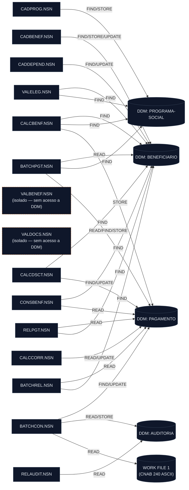

<!-- markdownlint-disable MD013 MD025 MD026 MD028 MD029 MD034 MD040 MD051 MD060 -->

# Mapa de Dependências — SIFAP Legado

  

> 🗺 **Você está aqui:** [Kit PT-BR](../README.md) → [Estágio 1](README.md) → **dependency-map**

> **Para quem é isto?** Este é um **artefato preenchido pelo time** durante o Estágio 1 (Arqueologia).
>
> **O que você terá ao final do estágio:**
>
> 1. Este documento totalmente preenchido com os dados reais do legado SIFAP
> 2. Rastreabilidade para `01-arqueologia/legado-sifap/` (programas `.NSN` e DDMs)
> 3. Base de evidência usada nas EARS do Estágio 2 (`source_legacy:`)
>
> 📘 **Guia passo a passo:** [`GUIDE.md`](GUIDE.md).

> **Escopo analisado:** `01-arqueologia/legado-sifap/natural-programs/` (todos os 15 `.NSN`), `recursive=true`.
> **Gerado por:** `@archaeologist-agent` via `/map-dependencies`. Toda aresta cita arquivo + linha. Nenhuma conexão foi inventada.

## Achado Central

**Não existe nenhuma instrução `CALLNAT`, `INCLUDE`, `CALL` ou `FETCH` em nenhum dos 15 programas.**
Logo, **há zero arestas programa-para-programa**. Cada programa é autocontido: o reúso acontece por **duplicação de lógica** (ex.: a tabela de fatores regionais e as faixas de renda aparecem copiadas em `CALCBENF` e `BATCHPGT`), não por chamada de subprograma. As únicas chamadas são `PERFORM` de sub-rotinas **internas** (intra-programa). O grafo inter-componente é, portanto, inteiramente **programa → dados (DDM Adabas)**.

## Diagrama Mermaid

> Fonte renderizável: [`dependency-map.mmd`](dependency-map.mmd).

## Arestas Programa-para-Programa

| Origem | Alvo | Tipo | Arquivo | Linha |
| ------ | ---- | ---- | ------- | ----- |
| _(nenhuma)_ | — | CALLNAT / INCLUDE | — | — |

> Não há nenhuma chamada `CALLNAT` nem diretiva `INCLUDE` no escopo. Ver **Observações** para a implicação (lógica duplicada vs. subprogramas compartilhados).

## Arestas Programa-para-Dados

> Operações: `FIND` = busca por descritor · `READ` = leitura sequencial/lógica · `STORE` = inserção · `UPDATE` = atualização. Nenhum `DELETE`, `GET` ou `HISTOGRAM` encontrado no escopo.

| Programa | DDM/Arquivo | Operação | Descritor/Chave | Arquivo | Linha |
| -------- | ----------- | -------- | --------------- | ------- | ----- |
| BATCHCON | AUDITORIA | READ | BY SEQ-AUDIT DESCENDING | `natural-programs/BATCHCON.NSN` | 88 |
| BATCHCON | WORK FILE 1 | READ | (arquivo retorno CNAB 240) | `natural-programs/BATCHCON.NSN` | 106 |
| BATCHCON | PAGAMENTO | FIND | NUM-PAGTO | `natural-programs/BATCHCON.NSN` | 139 |
| BATCHCON | PAGAMENTO | FIND | NUM-PAGTO | `natural-programs/BATCHCON.NSN` | 173 |
| BATCHCON | PAGAMENTO | UPDATE | (status='P') | `natural-programs/BATCHCON.NSN` | 178 |
| BATCHCON | PAGAMENTO | FIND | NUM-PAGTO | `natural-programs/BATCHCON.NSN` | 182 |
| BATCHCON | PAGAMENTO | UPDATE | (status='D') | `natural-programs/BATCHCON.NSN` | 185 |
| BATCHCON | PAGAMENTO | FIND | NUM-PAGTO | `natural-programs/BATCHCON.NSN` | 189 |
| BATCHCON | PAGAMENTO | UPDATE | (status='E') | `natural-programs/BATCHCON.NSN` | 192 |
| BATCHCON | AUDITORIA | STORE | — | `natural-programs/BATCHCON.NSN` | 249 |
| BATCHCON | AUDITORIA | STORE | — | `natural-programs/BATCHCON.NSN` | 268 |
| BATCHPGT | PAGAMENTO | READ | BY NUM-PAGTO DESCENDING | `natural-programs/BATCHPGT.NSN` | 171 |
| BATCHPGT | BENEFICIARIO | READ | BY CPF | `natural-programs/BATCHPGT.NSN` | 182 |
| BATCHPGT | PAGAMENTO | FIND | CPF-BENEF | `natural-programs/BATCHPGT.NSN` | 202 |
| BATCHPGT | PROGRAMA-SOCIAL | FIND | COD-PROGRAMA | `natural-programs/BATCHPGT.NSN` | 214 |
| BATCHPGT | PAGAMENTO | STORE | — | `natural-programs/BATCHPGT.NSN` | 335 |
| BATCHREL | PAGAMENTO | READ | BY COMPETENCIA | `natural-programs/BATCHREL.NSN` | 105 |
| BATCHREL | BENEFICIARIO | FIND | CPF | `natural-programs/BATCHREL.NSN` | 112 |
| CADBENEF | BENEFICIARIO | FIND | CPF | `natural-programs/CADBENEF.NSN` | 139 |
| CADBENEF | BENEFICIARIO | STORE | — | `natural-programs/CADBENEF.NSN` | 197 |
| CADBENEF | BENEFICIARIO | FIND | CPF | `natural-programs/CADBENEF.NSN` | 201 |
| CADBENEF | BENEFICIARIO | UPDATE | — | `natural-programs/CADBENEF.NSN` | 213 |
| CADDEPEND | BENEFICIARIO | FIND | CPF (titular) | `natural-programs/CADDEPEND.NSN` | 46 |
| CADDEPEND | BENEFICIARIO | FIND | CPF (titular) | `natural-programs/CADDEPEND.NSN` | 95 |
| CADDEPEND | BENEFICIARIO | FIND | CPF (titular) | `natural-programs/CADDEPEND.NSN` | 110 |
| CADDEPEND | BENEFICIARIO | UPDATE | — | `natural-programs/CADDEPEND.NSN` | 120 |
| CADPROG | PROGRAMA-SOCIAL | FIND | COD-PROGRAMA | `natural-programs/CADPROG.NSN` | 77 |
| CADPROG | PROGRAMA-SOCIAL | STORE | — | `natural-programs/CADPROG.NSN` | 102 |
| CADPROG | PROGRAMA-SOCIAL | FIND | COD-PROGRAMA | `natural-programs/CADPROG.NSN` | 109 |
| CALCBENF | BENEFICIARIO | FIND | CPF | `natural-programs/CALCBENF.NSN` | 148 |
| CALCBENF | PROGRAMA-SOCIAL | FIND | COD-PROGRAMA | `natural-programs/CALCBENF.NSN` | 167 |
| CALCBENF | PAGAMENTO | STORE | — | `natural-programs/CALCBENF.NSN` | 286 |
| CALCCORR | PAGAMENTO | READ | BY CPF-BENEF | `natural-programs/CALCCORR.NSN` | 128 |
| CALCCORR | PAGAMENTO | UPDATE | — | `natural-programs/CALCCORR.NSN` | 162 |
| CALCDSCT | PAGAMENTO | FIND | NUM-PAGTO | `natural-programs/CALCDSCT.NSN` | 74 |
| CALCDSCT | BENEFICIARIO | FIND | CPF | `natural-programs/CALCDSCT.NSN` | 88 |
| CALCDSCT | BENEFICIARIO | FIND | CPF | `natural-programs/CALCDSCT.NSN` | 108 |
| CALCDSCT | PAGAMENTO | FIND | NUM-PAGTO | `natural-programs/CALCDSCT.NSN` | 179 |
| CALCDSCT | PAGAMENTO | UPDATE | — | `natural-programs/CALCDSCT.NSN` | 181 |
| CONSBENF | BENEFICIARIO | FIND | CPF | `natural-programs/CONSBENF.NSN` | 88 |
| CONSBENF | BENEFICIARIO | FIND | NIS | `natural-programs/CONSBENF.NSN` | 92 |
| CONSBENF | PAGAMENTO | READ | BY CPF-BENEF | `natural-programs/CONSBENF.NSN` | 151 |
| RELAUDIT | AUDITORIA | READ | BY DT-EVENTO | `natural-programs/RELAUDIT.NSN` | 92 |
| RELPGT | PAGAMENTO | READ | BY COMPETENCIA | `natural-programs/RELPGT.NSN` | 82 |
| RELPGT | BENEFICIARIO | FIND | CPF | `natural-programs/RELPGT.NSN` | 104 |
| VALELEG | BENEFICIARIO | FIND | CPF | `natural-programs/VALELEG.NSN` | 70 |
| VALELEG | PROGRAMA-SOCIAL | FIND | COD-PROGRAMA | `natural-programs/VALELEG.NSN` | 88 |

## Sub-rotinas Internas (PERFORM — intra-programa)

> Não geram arestas no grafo inter-componente; listadas por completude.

| Programa | Sub-rotina (PERFORM) | Arquivo | Linha |
| -------- | -------------------- | ------- | ----- |
| BATCHCON | GRAVA-AUDITORIA-DIVERG | `natural-programs/BATCHCON.NSN` | 167 |
| BATCHCON | GRAVA-AUDITORIA-CONC | `natural-programs/BATCHCON.NSN` | 201 |
| BATCHPGT | DET-FAIXA-RENDA-BATCH | `natural-programs/BATCHPGT.NSN` | 262 |
| BATCHREL | IMPRIME-CABECALHO | `natural-programs/BATCHREL.NSN` | 172 |
| CADBENEF | VALIDA-CPF | `natural-programs/CADBENEF.NSN` | 112 |
| CADPROG | CONSULTA-PROG | `natural-programs/CADPROG.NSN` | 57 |
| CALCBENF | DET-FAIXA-RENDA | `natural-programs/CALCBENF.NSN` | 202 |
| CALCBENF | CALC-DESCONTOS | `natural-programs/CALCBENF.NSN` | 263 |
| CALCCORR | CALC-INDICE-ACUM | `natural-programs/CALCCORR.NSN` | 149 |
| CALCDSCT | CALC-CONTRIB-SOCIAL | `natural-programs/CALCDSCT.NSN` | 99 |
| CONSBENF | MASCARA-CPF | `natural-programs/CONSBENF.NSN` | 107 |
| RELAUDIT | IMPRIME-CAB-AUDIT | `natural-programs/RELAUDIT.NSN` | 165 |
| RELPGT | IMPRIME-SUBTOTAL | `natural-programs/RELPGT.NSN` | 94 |
| RELPGT | IMPRIME-CABECALHO | `natural-programs/RELPGT.NSN` | 145 |
| RELPGT | IMPRIME-SUBTOTAL | `natural-programs/RELPGT.NSN` | 174 |
| VALBENEF | VALIDA-CPF-COMPLETO | `natural-programs/VALBENEF.NSN` | 115 |
| VALBENEF | VALIDA-DATA | `natural-programs/VALBENEF.NSN` | 125 |
| VALBENEF | VALIDA-NOME | `natural-programs/VALBENEF.NSN` | 135 |
| VALDOCS | VALIDA-CPF-DOC | `natural-programs/VALDOCS.NSN` | 68 |
| VALDOCS | VALIDA-RG | `natural-programs/VALDOCS.NSN` | 78 |
| VALDOCS | CHECK-DOC-ESPECIAL | `natural-programs/VALDOCS.NSN` | 88 |
| VALELEG | VERIF-ELEG-ESPECIFICA | `natural-programs/VALELEG.NSN` | 207 |

## Referências Quebradas

Nenhum alvo de `CALLNAT`/`INCLUDE` aponta para arquivo inexistente, porque **não há nenhum `CALLNAT`/`INCLUDE`**. Há, no entanto, **dependências fantasma documentadas** (declaradas em cabeçalho/docs mas ausentes no código):

| Declarada em | Texto | Realidade no código |
| ------------ | ----- | ------------------- |
| `natural-programs/BATCHPGT.NSN` (cabeçalho, L13) | "CHAMA CALCBENF E CALCDSCT" | Nenhum `CALLNAT`; o cálculo de benefício e o desconto estão **reescritos inline** dentro do próprio BATCHPGT. |
| `natural-programs/BATCHCON.NSN` (L205–222) | Integração "BANCO REAL" via `WORK FILE 2` | Bloco inteiro **comentado** (código morto desde a aquisição pelo Santander em 2007). |

## Observações

- **Total de programas no escopo:** 15.
- **Total de arestas programa-para-programa:** 0 (nenhum `CALLNAT`/`INCLUDE`/`CALL`/`FETCH`).
- **Total de arestas programa-para-dados:** 47 (46 a DDMs Adabas + 1 a Work File CNAB).
- **Programa mais conectado (maior grau de saída de dados):** `BATCHCON.NSN` — 10 arestas (PAGAMENTO ×6, AUDITORIA ×3, Work File ×1).
- **DDM mais acessado:** `PAGAMENTO` — 19 arestas, por 8 programas distintos (é o hub de dados do sistema). Em seguida `BENEFICIARIO` (17), `PROGRAMA-SOCIAL` (6), `AUDITORIA` (4).
- **Programas isolados (sem nenhuma aresta de dados nem de programa):** `VALBENEF.NSN` e `VALDOCS.NSN` — só contêm validações via `PERFORM` interno; recebem/retornam dados por parâmetros, mas como nenhum outro programa os chama via `CALLNAT`, ficam órfãos no grafo. **Sinal de alerta:** validações que deveriam ser compartilhadas não são reutilizadas.
- **Acoplamento por dados, não por chamada:** todo o "acoplamento" do SIFAP é via tabelas Adabas compartilhadas (`PAGAMENTO` e `BENEFICIARIO`). Vários programas escrevem em `PAGAMENTO` (`CALCBENF` STORE, `BATCHPGT` STORE, `CALCDSCT`/`CALCCORR`/`BATCHCON` UPDATE) — concorrência e ordem de execução são governadas por convenção, não pelo código.
- **Risco de migração:** a lógica de cálculo está **duplicada** (ex.: tabela de fatores regionais e faixas de renda em `CALCBENF` e `BATCHPGT`). Extrair um serviço único de cálculo (Strangler Fig) exige reconciliar as duas cópias — elas podem ter divergido (ver nota de arredondamento ROUND vs TRUNCATE em `BATCHREL`).

## Definição de Pronto

- [x] Arquivo Mermaid existe e renderiza um grafo válido ([`dependency-map.mmd`](dependency-map.mmd)).
- [x] Todo nó corresponde a um arquivo real (15 `.NSN` + 4 DDMs + 1 work file).
- [x] Toda aresta cita arquivo-fonte e número de linha.
- [x] Referências quebradas / dependências fantasma listadas explicitamente.
- [x] Arestas de dados distinguem READ, FIND, STORE, UPDATE (não há DELETE/GET/HISTOGRAM no escopo).

---

### Continuar a leitura

<table width="100%">
<tr>
<td width="50%" valign="top" align="left">
<strong>← ANTERIOR</strong> 
<a href="business-rules-catalog.md"><strong>business-rules-catalog.md</strong></a> 
Catálogo de regras.
</td>
<td width="50%" valign="top" align="right">
<strong>PRÓXIMO →</strong> 
<a href="discovery-report.md"><strong>discovery-report.md</strong></a> 
Síntese final.
</td>
</tr>
</table>

↑ <a href="README.md">Voltar ao Kit PT-BR</a>

