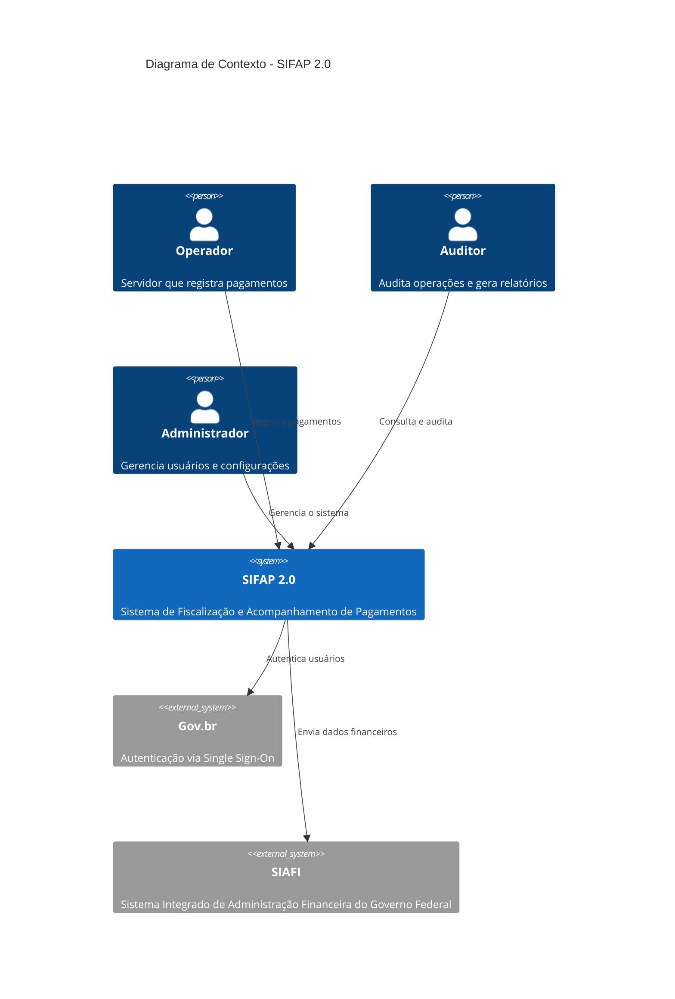
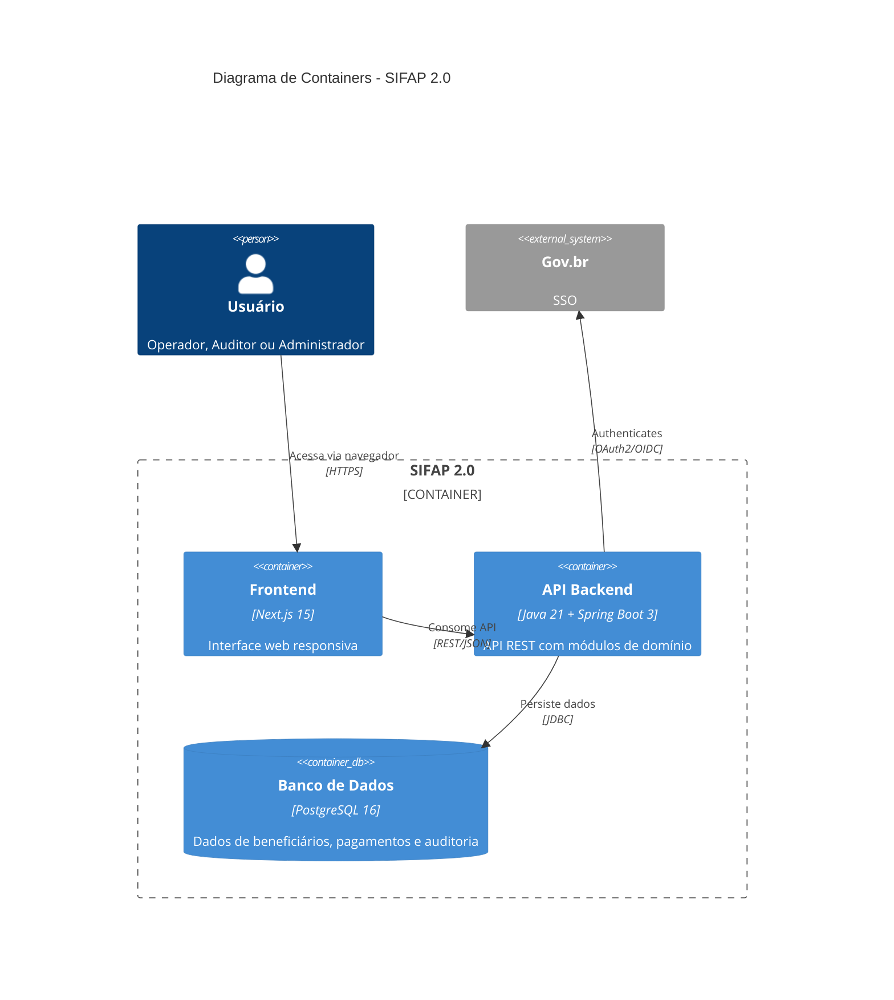

<!-- markdownlint-disable MD013 MD025 MD026 MD028 MD029 MD034 MD040 MD051 MD060 -->

# Estágio 2 — Spec Moderna (60 min)


> 🗺 **Você está aqui:** [Kit PT-BR](../README.md) → [Estágio 2](README.md) → **GUIDE**

> **Para quem é isto?** Para o par 2 (EA+SA) que lidera + par 1 (escopo) + par 5 (revisão de clareza).
>
> **O que você terá ao final desta leitura:**
>
> 1. Escreverá requisitos EARS com `source_legacy:` obrigatório
> 2. Produzirá 3+ ADRs estruturais
> 3. Desenhará C4 L1 e L2 do sistema moderno
> 4. Receberá sign-off do PO antes do Passagem #2 às 15:00

  -1A1A1A?style=for-the-badge)

> ⏰ **Cronograma exato** vive em [`00-TEAM-FLOW.md`](../00-TEAM-FLOW.md) §2. Os badges aqui mostram apenas a **duração** do estágio.

> **Categoria:** Especificação · **Quem trabalha agora:** Par 2 lidera · Par 1 assina escopo

> 🧭 **Antes de entrar neste estágio** (1 minuto de leitura):
>
> - **EARS, ADR, REQ-ID, bounded context, source_legacy** — termos novos? [`../07-conceitos/03-glossario-visual.md`](../07-conceitos/03-glossario-visual.md) tem cada um com analogia.
> - **Quer ver uma spec pronta?** [`../08-exemplos/SPECIFICATION-exemplo.md`](../08-exemplos/SPECIFICATION-exemplo.md) (8 REQ-IDs reais com `source_legacy` e `acceptance`).
> - **ADR completo de referência:** [`../08-exemplos/ADR-001-monolito-modular-exemplo.md`](../08-exemplos/ADR-001-monolito-modular-exemplo.md).
> - **Spec-Kit travado?** [`../09-cheat-sheets/spec-kit-workflow.md`](../09-cheat-sheets/spec-kit-workflow.md) cobre `/speckit.specify → clarify → plan → tasks`.
> - **Confuso entre Ask, Plan e Agent?** [`../09-cheat-sheets/copilot-3-modes.md`](../09-cheat-sheets/copilot-3-modes.md).

> [!IMPORTANT]
> **Regra dura — rastreabilidade obrigatória.** Todo requisito EARS no seu `SPECIFICATION.md` precisa incluir uma linha `source_legacy:` apontando para um arquivo `.NSN` ou `.ddm` dentro de [`../01-arqueologia/legado-sifap/`](../01-arqueologia/legado-sifap/), **ou** ser marcado `source_legacy: "[GREENFIELD] <justificativa de uma linha>"`. O CI rejeita PRs que violem isso. Facilitadores verificam por amostragem no Passagem #2 (~16:00).
>
> Por quê? Na edição anterior alguns times escreveram specs só a partir do brief de modernização, pulando a leitura do legado. Os protótipos perderam regras de negócio reais. Desta vez, rastreabilidade é o portão.

Você está no **Estágio 2**. A saída deste estágio (REQ-IDs, ADRs, C4) alimenta diretamente o Estágio 3. Sem `source_legacy:` em cada REQ-ID, o passagem #2 falha.

## ⛳ Definition of Ready — antes de começar

> [!IMPORTANT]
> Não abra este estágio sem antes confirmar:
>
> - [ ] Estágio 1 terminou (DoD verde no `LEGACY-EXPLORATION-CHECKLIST.md`)
> - [ ] Você selecionou **`@architect`** no Copilot Chat
> - [ ] Catálogo `business-rules-catalog.md` tem ≥15 regras com `Programa Fonte`
> - [ ] Você tem o `discovery-report.md` aberto como input
> - [ ] Aba aberta em [`07-conceitos/05-ears-receita-de-cogumelo.md`](../07-conceitos/05-ears-receita-de-cogumelo.md)
> - [ ] Spec-Kit funciona: `specify version` responde

## Quem trabalha aqui


## Objetivo

Transformar as descobertas do Estágio 1 (arqueologia) em uma especificação técnica moderna e estruturada, usando notação EARS para requisitos, ADRs para decisões de arquitetura e diagramas C4 para visualização. Todo artefato precisa rastrear até evidência no legado ou declarar sua natureza greenfield.

## Por que isso importa

Especificação é onde o entendimento vira contrato. No Estágio 1 vocês descobriram regras; aqui essas regras viram **REQ-IDs testáveis** que os desenvolvedores do Estágio 3 vão implementar. Se a EARS for ambígua, o Dev vai chutar — e o chute geralmente acerta o brief, não o sistema real.

A regra de ouro é simples: **toda EARS aponta para uma linha de `.NSN` ou para `[GREENFIELD]` com justificativa**. Sem essa âncora, a spec vira lista de desejos.

## Como pensar nisso

Pense na spec como uma **ponte entre dois mundos**: o código legado (passado) e o código moderno (futuro). Cada REQ-ID é uma viga dessa ponte. Se uma viga não está ancorada nos dois lados, a ponte cai no Estágio 3.

- **Lado legado:** `source_legacy:` aponta para o `.NSN` ou `.ddm` que originou a regra.
- **Lado moderno:** EARS escrita em um dos 6 padrões, com `acceptance:` testável.

REQ-IDs sem `source_legacy` viram débito técnico imediato. REQ-IDs sem `acceptance` testável viram tarefas sem critério de pronto.

## Referência ouro

Antes de começar, estude a especificação de referência:

```
03-spec-sifap-moderno/SPECIFICATION.md
```

Esse documento mostra o formato e o nível de detalhe esperado. Sua spec deve seguir a mesma estrutura — incluindo `source_legacy:` em todo requisito.

---

## Notação EARS — Easy Approach to Requirements Syntax

EARS é um método para escrever requisitos sem ambiguidade. São **6 padrões** que eliminam linguagem vaga. No fluxo Spec-Kit, use `/speckit.clarify` e `/speckit.analyze` para detectar ambiguidades, lacunas e inconsistências antes da implementação.

### Padrão 1: Ubiquitous (sempre vale)

> **O [sistema] deve [ação].**

Exemplo SIFAP:

> O SIFAP deve armazenar todos os registros de pagamento com timestamp UTC.

Use quando: a regra vale SEMPRE, sem condição.

### Padrão 2: Event-Driven (quando algo acontece)

> **Quando [evento], o [sistema] deve [ação].**

Exemplo SIFAP:

> Quando um beneficiário é cadastrado, o SIFAP deve validar o CPF usando o algoritmo módulo 11 da Receita Federal.

Use quando: a regra só vale após um evento específico.

### Padrão 3: State-Driven (enquanto uma condição vale)

> **Enquanto [condição], o [sistema] deve [ação].**

Exemplo SIFAP:

> Enquanto um pagamento estiver com status PENDING, o SIFAP deve permitir cancelamento por um usuário com perfil OPERATOR.

Use quando: a regra só vale durante um estado.

### Padrão 4: Optional (se o usuário escolher)

> **Onde [condição opcional], o [sistema] deve [ação].**

Exemplo SIFAP:

> Onde o operador escolher exportar o relatório, o SIFAP deve gerar um arquivo CSV com codificação UTF-8.

Use quando: a funcionalidade não é obrigatória — depende de escolha do usuário.

### Padrão 5: Unwanted Behavior (o que NÃO deve acontecer)

> **O [sistema] não deve [ação indesejada].**

Exemplo SIFAP:

> O SIFAP não deve permitir exclusão de registros da tabela de auditoria.
> O SIFAP não deve processar pagamentos para beneficiários com status CANCELLED.

Use quando: você precisa documentar restrições ou proibições explícitas.

### Padrão 6: Complex Scenario (combinação de condições)

> **Enquanto [condição], quando [evento], onde [condição opcional], o [sistema] deve [ação].**

Exemplo SIFAP:

> Enquanto o beneficiário estiver com status ACTIVE, quando um ciclo de pagamento for gerado em dezembro, o SIFAP deve calcular o 13º salário usando uma fórmula diferenciada.

Use quando: múltiplas condições se combinam.

### Exemplo: requisito RUIM vs. BOM

Compare lado a lado — o vago vs o EARS testável:

```diff
- "O sistema deve ser seguro"
+ "O SIFAP deve mascarar CPF em logs usando o formato XXX.XXX.NNN-NN"

- "Pagamentos devem ser processados"
+ "Quando um ciclo for gerado, o SIFAP deve criar registros de pagamento
+  para todos os beneficiários com status ACTIVE"

- "Auditoria completa"
+ "Quando qualquer entidade for alterada, o SIFAP deve gravar um registro
+  de auditoria com estado anterior e posterior em formato JSON"
```

> [!TIP]
> O lado `+` (verde) é o que o time entrega. O lado `-` (vermelho) é o que vai virar débito técnico ou interpretação livre do Dev.

### Dica: todo requisito precisa ser TESTÁVEL

Ao escrever um requisito, pergunte: _"Como eu testaria isso automaticamente?"_ Se não souber responder, o requisito está vago demais.

| Requisito                                                                         | Teste                                   |
| --------------------------------------------------------------------------------- | --------------------------------------- |
| REQ-BEN-01: "O SIFAP deve validar CPF com módulo 11"                              | CPF inválido retorna erro 400           |
| REQ-PAY-03: "Quando um ciclo for gerado, criar pagamentos para beneficiários ACTIVE" | 10 ativos + 2 suspensos = 10 pagamentos |
| REQ-AUD-01: "O SIFAP não deve permitir DELETE em auditoria"                       | DELETE retorna erro 403                 |

---

## Exemplo concreto: do legado ao teste

Veja o ciclo completo de uma regra do SIFAP, do código legado até o teste automatizado.

### 1. Regra encontrada no Estágio 1

No programa `CALCDSCT.NSN`, o time descobre:

```natural
* CHECK DEDUCTION CAP
IF #TIPO-DSCT NE 'J'
 IF #VLR-TOTAL-DSCT > (#VLR-BRUTO * 0.30)
 COMPUTE #VLR-TOTAL-DSCT = #VLR-BRUTO * 0.30
 END-IF
END-IF
```

**Interpretação**: descontos têm teto de 30% do valor bruto, EXCETO descontos judiciais (tipo 'J'), que não têm teto.

### 2. Requisito EARS (Estágio 2)

Usando os padrões **Unwanted Behavior** + **Event**:

```yaml
REQ-PAY-DSCT-01:
 pattern: unwanted
 text: "O SIFAP não deve permitir que o total de descontos não judiciais exceda
 30% do valor bruto do pagamento."
 source_legacy: 01-arqueologia/legado-sifap/natural-programs/CALCDSCT.NSN#L142-L148
 acceptance:
 - "Desconto não judicial de 35% é truncado para 30%"
 - "Desconto judicial de 50% é aceito integralmente"
 - "Mistura de judicial (20%) + não judicial (25%) = total de 45% aceito"

REQ-PAY-DSCT-02:
 pattern: event-driven
 text: "Quando um desconto judicial é aplicado, o SIFAP deve adicionar o valor
 ao total de descontos sem aplicar o teto de 30%."
 source_legacy: 01-arqueologia/legado-sifap/natural-programs/CALCDSCT.NSN#L142-L148
```

### 3. Código (Estágio 3)

```java
// payment/application/PaymentService.java
public BigDecimal calculateTotalDeductions(List<Deduction> deductions, BigDecimal grossAmount) {
 BigDecimal judicialTotal = deductions.stream()
 .filter(d -> "JUDICIAL".equals(d.type()))
 .map(Deduction::amount)
 .reduce(BigDecimal.ZERO, BigDecimal::add);

 BigDecimal otherTotal = deductions.stream()
 .filter(d -> !"JUDICIAL".equals(d.type()))
 .map(Deduction::amount)
 .reduce(BigDecimal.ZERO, BigDecimal::add);

 BigDecimal maxOther = grossAmount.multiply(new BigDecimal("0.30"));
 otherTotal = otherTotal.min(maxOther); // teto de 30%

 return judicialTotal.add(otherTotal); // judicial não tem teto
}
```

### 4. Teste (Estágio 3)

```java
@Test
@DisplayName("REQ-PAY-DSCT-01: Non-judicial deductions capped at 30%")
void nonJudicialDeductionsCappedAt30Percent() {
 var deductions = List.of(new Deduction("TAX", new BigDecimal("350.00")));
 var gross = new BigDecimal("1000.00");

 var total = service.calculateTotalDeductions(deductions, gross);

 assertThat(total).isEqualByComparingTo("300.00"); // 35% trucanado em 30%
}

@Test
@DisplayName("REQ-PAY-DSCT-02: Judicial deductions bypass 30% cap")
void judicialDeductionsBypass30PercentCap() {
 var deductions = List.of(new Deduction("JUDICIAL", new BigDecimal("500.00")));
 var gross = new BigDecimal("1000.00");

 var total = service.calculateTotalDeductions(deductions, gross);

 assertThat(total).isEqualByComparingTo("500.00"); // sem teto para judicial
}
```

### Rastreabilidade

| Artefato     | ID                                          | Referência                  |
| ------------ | ------------------------------------------- | --------------------------- |
| Regra legada | BR-006                                      | CALCDSCT.NSN linhas 142–148 |
| Requisito    | REQ-PAY-DSCT-01/02                          | SPECIFICATION.md            |
| Código       | `PaymentService.calculateTotalDeductions()` | payment/application/        |
| Teste        | `PaymentServiceTest` (2 métodos)            | payment/application/        |

Esse ciclo é o que o Spec-Kit torna explícito em `spec.md`, `plan.md` e `tasks.md`. Se o código divergir da spec, volte ao artefato de origem antes de implementar mais.

---

## ADRs — Arquitetura Decision Records

ADRs documentam decisões importantes de arquitetura. Para cada decisão, crie um arquivo usando o template [`ADR-TEMPLATE.md`](ADR-TEMPLATE.md).

### Quando criar um ADR?

- Escolha de tecnologia (banco, framework, etc.)
- Padrão arquitetural (modular monolith vs. microsserviços)
- Estratégia de migração (big bang vs. incremental)
- Trade-offs significativos (performance vs. simplicidade)

### ADRs esperados (mínimo 3)

1. **ADR-001**: Escolha de arquitetura (ex.: modular monolith)
2. **ADR-002**: Estratégia de migração de dados
3. **ADR-003**: Autenticação e autorização
4. ADR-004 a ADR-005: decisões adicionais do time

---

## Diagramas C4 — Contexto, Containers, Componentes

Use Mermaid para criar pelo menos os diagramas **Contexto (C4-L1)** e **Containers (C4-L2)**.

### Exemplo C4-L1: diagrama de contexto



### Exemplo C4-L2: diagrama de containers



---

## Decisões de Escopo

Use o arquivo [`scope-decisions.md`](scope-decisions.md) para registrar o que será migrado, descartado ou evoluído.

---

## Workflow do Spec-Kit — RECOMENDADO

> **O que é Spec-Kit?** É o toolkit oficial do GitHub para Spec-Driven Development. Ele fornece templates, scripts e slash commands `/speckit.*` para seu agente de codificação.

**Spec-Kit** (<https://github.com/github/spec-kit>) é o motor de SDD usado neste workshop. Ele transforma uma intenção em `spec.md`, `plan.md`, `tasks.md` e implementação guiada.

### Já vem instalado

O Spec-Kit **já vem configurado no repositório do time** (veio do template). A configuração `.specify/` e os slash commands `/speckit.*` já estão prontos no Copilot. **Você não instala nem inicializa nada.**

### Verifique os comandos

Abra o Copilot Chat e digite `/`. Se os comandos `/speckit.*` não aparecerem, abra o VS Code na raiz do repositório do time e recarregue: Command Palette → **Developer: Reload Window**.

### Slash commands do Spec-Kit

| Comando | Descrição |
| --- | --- |
| `/speckit.constitution` | Cria princípios e regras do projeto |
| `/speckit.specify` | Escreve `specs/<feature>/spec.md` |
| `/speckit.clarify` | Resolve ambiguidades antes do plano |
| `/speckit.plan` | Gera `plan.md`, pesquisa e contratos |
| `/speckit.tasks` | Gera `tasks.md` implementável |
| `/speckit.analyze` | Analisa consistência e cobertura |
| `/speckit.implement` | Implementa a feature guiada pelos artefatos |

### Fluxo recomendado para o Estágio 2

```
1. /speckit.constitution
 → Cria ou atualiza `.specify/memory/constitution.md`

2. /speckit.specify "Modernize SIFAP payment cycle preserving source_legacy traceability"
 → Cria estrutura em `specs/001-sifap-payment-cycle/`

3. /speckit.clarify
 → Resolve ambiguidades da spec antes do design

4. /speckit.plan "Use Java 21, Spring Boot 3.3, PostgreSQL 16, Next.js 15 and modular monolith"
 → Gera plano técnico e decisões rastreáveis

5. /speckit.tasks
 → Gera tarefas para implementação

6. /speckit.analyze
 → Verifica lacunas antes de implementar
```

### Se o Spec-Kit NÃO estiver disponível

Sem pânico — escreva os requisitos EARS manualmente em SPECIFICATION.md seguindo os 6 padrões acima. O formato é texto puro.

---

<details>
<summary><strong>Armadilhas comuns</strong> — clique para expandir</summary>

| ❌ Se você está fazendo isso                               | ✅ Faça assim                                                             |
| ---------------------------------------------------------- | ------------------------------------------------------------------------- |
| Escrevendo EARS sem `source_legacy:`                       | Toda REQ-ID aponta para `.NSN`/`.ddm` ou `[GREENFIELD]` com justificativa |
| Requisito vago ("o sistema deve ser performático")         | EARS com critério testável: "p95 < 200ms para queries de listagem"        |
| Reescrevendo o brief de modernização em forma de requisito | Volte ao catálogo do Estágio 1; o brief não é a fonte da verdade          |
| ADR de 1 linha ("decidimos usar X")                        | ADR com contexto + decisão + alternativas rejeitadas + consequências      |
| Pulando `/speckit.clarify` e `/speckit.analyze`             | Rode antes de fazer commit; o CI rejeita PRs com EARS inválidas           |
| C4 nível 3 antes de finalizar o nível 1                    | L1 e L2 são suficientes para 95% dos casos. L3 só se sobrar tempo         |

</details>

---

## Como saber que terminou (Definição de Pronto)

Ao final do Estágio 2, seu time deve ter:

- [ ] `SPECIFICATION.md` completo com EARS (arquivo: `02-spec-moderna/SPECIFICATION.md`)
- [ ] 100% das REQ-IDs com `source_legacy:` preenchido
- [ ] 3 a 5 ADRs (arquivos: `02-spec-moderna/ADR-001.md`, `ADR-002.md`, etc.)
- [ ] Diagrama C4 em Mermaid (dentro de SPECIFICATION.md ou em arquivo separado)
- [ ] Decisões de escopo documentadas (arquivo: `02-spec-moderna/scope-decisions.md`)
- [ ] Par 1 (PO) assinou o sign-off de escopo no PR

---

## Próximo passo

No Passagem #2 (~16:00), o **Par 2 (Arquitetura)** entrega EARS + ADRs + C4 para os **Pares 3 (Implementação) e 4 (Qualidade)**. O Par 1 (PO) assina o escopo. Conversa de 5 minutos por par receptor — não vale "leia o documento depois". Vocês caminham juntos para o Estágio 3 ([`../03-implementacao/GUIDE.md`](../03-implementacao/GUIDE.md)).

<details>
<summary><strong>Prompts úteis para Copilot Chat</strong> — clique para expandir</summary>

1. _"Converta esta regra de negócio para notação EARS: [descreva a regra]. Identifique qual dos 6 padrões EARS se aplica e justifique."_
2. _"Crie um ADR para a decisão de usar [tecnologia X] em vez de [tecnologia Y]. Inclua o 'caminho não tomado' e as consequências negativas."_
3. _"Gere um diagrama C4 de contexto em Mermaid para um sistema que [descrição]."_
4. _"Revise este requisito EARS e sugira melhorias de clareza. Aponte ambiguidades."_
5. _"Quais atributos de qualidade (NFRs) devemos considerar para este sistema?"_
6. _"Com base nestas regras de negócio, sugira a estrutura de módulos do backend (bounded contexts)."_

</details>

## Dica de ouro

> [!TIP]
> Não reinvente a roda. A especificação de referência em `03-spec-sifap-moderno/SPECIFICATION.md` já tem a estrutura ideal. Use como base e adapte com as descobertas do seu time.

---

---

### Continuar a leitura

<table width="100%">
<tr>
<td width="50%" valign="top" align="left">
<sub><strong>← ANTERIOR</strong></sub><br/>
<a href="../01-arqueologia/GUIDE.md"><strong>Estágio 1 — Arqueologia</strong></a><br/>
<sub>11:00–12:00 + 13:30–14:00 · Ler o legado e catalogar regras de negócio.</sub>
</td>
<td width="50%" valign="top" align="right">
<sub><strong>PRÓXIMO →</strong></sub><br/>
<a href="../03-implementacao/GUIDE.md"><strong>Estágio 3 — Implementação</strong></a><br/>
<sub>15:00–16:10 · Java 21 + Spring Boot + Next.js, com testes.</sub>
</td>
</tr>
</table>

<sub>↑ <a href="../README.md">Voltar ao Kit PT-BR</a></sub>

— Paula
