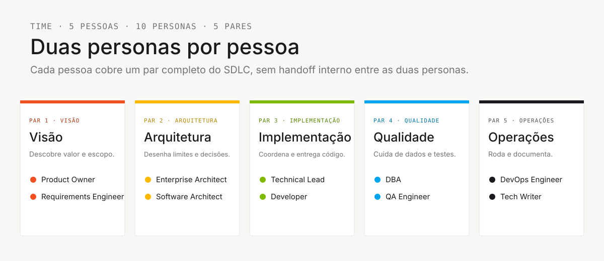

<!-- markdownlint-disable MD013 MD025 MD026 MD028 MD029 MD033 MD034 MD040 MD051 MD060 -->

# Persona Kits

  

> 🗺 **Você está aqui:** [Kit PT-BR](../README.md) → **Personas**

> **Para quem é isto?** Quem vai usar os persona-kits Copilot no laptop.
>
> **O que você terá ao final desta leitura:**
>
> 1. Saber identificar suas 2 personas
> 2. Entender que os kits `.github/*` já vêm no repositório (sem cópia)
> 3. Validar que slash commands aparecem no Copilot Chat
> 4. Saber para onde ir depois (Estágio 1 às 11:00)

> Esta pasta contém **somente os 10 kits usados neste workshop**. O time tem 5 pessoas; cada pessoa usa 2 kits do mesmo par. Cada kit é a fonte única da persona: `PERSONA.md` descreve o papel, e os artefatos `.github/`, `mcp.json`, prompts e skills configuram o Copilot para esse mesmo papel.

## Por que estes 10 kits

O time do workshop tem 5 pessoas, cada uma usando 2 personas. Isso cobre o SDLC inteiro sem carregar papéis extras que não entram na dinâmica do dia.

| Par | Personas | Kits Copilot |
| --- | --- | --- |
| 1 · Visão | Product Owner + Requirements Engineer | `01-product-owner/` + `02-requirements-engineer/` |
| 2 · Arquitetura | Enterprise Architect + Software Architect | `03-enterprise-architect/` + `04-software-architect/` |
| 3 · Implementação | Technical Lead + Developer | `05-technical-lead/` + `06-developer/` |
| 4 · Qualidade | DBA + QA Engineer | `07-dba/` + `08-qa-engineer/` |
| 5 · Operações | DevOps Engineer + Tech Writer | `09-devops-engineer/` + `10-tech-writer/` |

## O que cada kit contém

Cada pasta de persona segue uma estrutura consistente:

| Artefato | Propósito |
| --- | --- |
| `PERSONA.md` | Carta completa da persona: responsabilidades, passagens, prompts e critérios de avaliação |
| `README.md` | Inventário do kit Copilot e guia de instalação |
| `mcp.json` | Recomendações de servidores MCP para o papel |
| `.github/agents/*.agent.md` | Agente Copilot ajustado ao papel |
| `.github/skills/*/SKILL.md` | Modelos mentais reutilizáveis |
| `.github/prompts/*.prompt.md` | Prompts prontos para tarefas recorrentes |
| `.github/instructions/*.instructions.md` | Regras específicas de arquivos ou domínios, quando existirem |

## Kits disponíveis

| # | Kit | Papel no workshop |
| --- | --- | --- |
| 01 | [Product Owner](./01-product-owner/PERSONA.md) | Prioridade, escopo, valor e narrativa do demo |
| 02 | [Requirements Engineer](./02-requirements-engineer/PERSONA.md) | Requisitos EARS, critérios de aceitação e rastreabilidade |
| 03 | [Enterprise Architect](./03-enterprise-architect/PERSONA.md) | C4 L1, topologia e decisões de sistema |
| 04 | [Software Architect](./04-software-architect/PERSONA.md) | C4 L2/L3, bounded contexts e ADRs |
| 05 | [Technical Lead](./05-technical-lead/PERSONA.md) | Padrões, coordenação técnica e review |
| 06 | [Developer](./06-developer/PERSONA.md) | Código Java/TypeScript, testes e integração |
| 07 | [DBA](./07-dba/PERSONA.md) | Modelo PostgreSQL, migrações e mapeamento DDM |
| 08 | [QA Engineer](./08-qa-engineer/PERSONA.md) | Estratégia de testes, cobertura e gates |
| 09 | [DevOps Engineer](./09-devops-engineer/PERSONA.md) | CI/CD, Terraform, secrets e deploy |
| 10 | [Tech Writer](./10-tech-writer/PERSONA.md) | Glossário, clareza de ADR, README e runbook |

## Como ativar uma persona

### Passo a passo

> **Pré-requisito.** Você já seguiu o [00-SETUP.md](../00-SETUP.md) para clonar o repositório do time e ativar o Copilot. Os kits `.github/` de todas as 10 personas **já vêm no repositório** (vieram do template) — **não há nada para copiar nem instalar**.

1. **Identifique suas duas personas.** Veja seu par em [00-TEAM-FLOW.md](../00-TEAM-FLOW.md).
2. **Leia as duas cartas.** Abra `05-personas/<role>/PERSONA.md` para cada papel do seu par.
3. **Abra o repositório do time no VS Code.** Os agentes e slash commands já estão disponíveis no Copilot Chat.
4. **Verifique.** Digite `@` no painel do Copilot e confirme que os 4 agentes de estágio aparecem. Digite `/` e confira os slash commands (ex.: `/ears-convert`).

> [!NOTE]
> Se um agente ou slash command não aparecer, recarregue a janela: Command Palette → **Developer: Reload Window**.

## Como estudar um kit em 10 minutos

1. **Leia `PERSONA.md` primeiro.** Ele explica missão, responsabilidades, passagens e como a persona é avaliada.
2. **Abra o `README.md` do kit.** Ele mostra quais agents, prompts, skills e MCPs existem.
3. **Veja os prompts disponíveis.** Eles são atalhos para tarefas recorrentes, não substitutos para julgamento.
4. **Confira skills e instructions.** Skills guardam workflows; instructions aplicam regras por tipo de arquivo.
5. **Anote seu passagem.** Toda persona precisa saber de quem recebe trabalho e para quem entrega.

## Definição de Pronto da instalação

- [ ] A pessoa leu os dois `PERSONA.md` do seu par.
- [ ] Os dois `.github/` dos kits foram copiados para o repositório do time.
- [ ] `mcp.json` foi copiado para `.vscode/` quando existir.
- [ ] O VS Code foi recarregado.
- [ ] Os agentes aparecem ao digitar `@` no Copilot Chat.
- [ ] Os prompts aparecem ao digitar `/` no Copilot Chat.

---

### Continuar a leitura

<table width="100%">
<tr>
<td width="50%" valign="top" align="left">
<strong>← ANTERIOR</strong> 
<a href="../00-SETUP.md"><strong>SETUP</strong></a> 
Setup do laptop: Git, VS Code, Copilot, Spec-Kit, branch protection.
</td>
<td width="50%" valign="top" align="right">
<strong>PRÓXIMO →</strong> 
<a href="OVERVIEW.md"><strong>OVERVIEW das 10 personas</strong></a> 
Tabela comparativa: par, líder de estágio, defaults de emergência.
</td>
</tr>
</table>

↑ <a href="../README.md">Voltar ao Kit PT-BR</a>

— Paula
